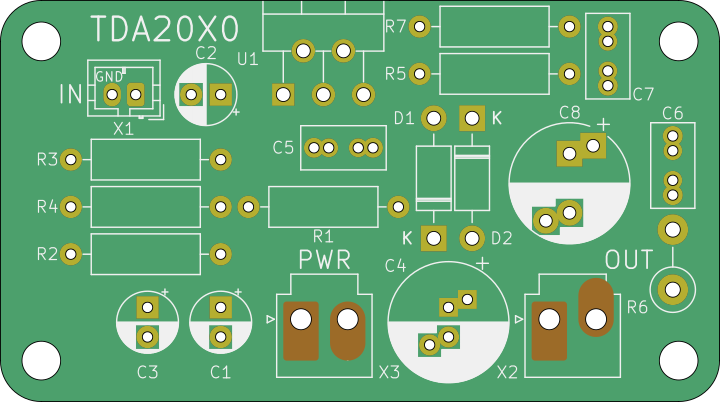

# TDA2030 DIY Audio Power Amplifier Circuit

This is a simple class AB audio amplifier built around the TDA2030 audio amplifier integrated circuit. It’s a classic beginner-friendly design often used for small speakers, desktop audio, or homemade powered speakers, where only one power supply voltage is available.

EDA: **Kicad 6.0.11**
PCB dimensions: **61 x 34 mm** single sided

Circuit is versatile: it can also accomodate TDA2030A, TDA2050 and LM1875 due to same pinout, but in all cases heat sink for IC is mandatory!

# Expected performance

| Supply Voltage | Speaker | Approx. Power |
|---|---|---|
| 12V | 8Ω | 6–8W |
| 18V | 4Ω | 14–18W |

## Power supply
- 12 V–18 V regulated DC supply
- 2 A or more

## When built

Before connecting the loudspeaker and input source, measure (bias) voltage at test point TP1. The voltage here should be a half of supply voltage. If it's not check both resistors R₁ and R₂ or replace C₁. Capacitor may have too low resistance and some current is flowing through, resulting in bias voltage drop. The same voltage should be at test point TP2 just before output DC decoupling capacitor.

| Component | Recommended value | Purpose | Larger than recommended value | Smaller than recommended value |
|-----------|------------------|---------|------------------------------|-------------------------------|
| R₁/R₂ | 100 kΩ | Bias voltage divider | Poor high-frequency attenuation | Danger of oscillation |
| R₃ | 100 kΩ | Non-inverting input biasing | Increase of input impedance | Decrease in input impedance |
| R₄ | 4,7kΩ | Closed loop gain setting | Decrease of gain | Increase in gain |
| R₅ | 100 kΩ | Closed loop gain setting | Increase of gain | Decrease in gain |
| R₆ | 1 Ω | Frequency stability | Danger of oscillation at high frequencies with inductive loads | — |
| R₇ | 2 kΩ | Upper frequency cutoff | Poor high-frequency attenuation | — |
| C₁ | 10 µF | Bias voltage stabilizing | | |
| C₂ | 2,2 µF | Input DC decoupling | — | Increase in low-frequency cutoff |
| C₃ | 2,2 µF | Inverting input DC decoupling | — | Increase in low-frequency cutoff |
| C₄ | 220 µF | Supply voltage bypass | — | Danger of oscillation |
| C₅ | 0,22 µF | Supply voltage bypass | — | Danger of oscillation |
| C₆ | 0,22 µF | Frequency stability | — | Danger of oscillation |
| C₇ | 1 / (2πBR₅) | Upper frequency cutoff | Smaller bandwidth | Larger bandwidth |
| C₈ | 2200 µF | Output DC decoupling | — | Increase in low-frequency cutoff |
| D₁, D₂ | 1N4001 | To protect the device against output voltage spikes | — | — |

These values are from ST TDA2030A datasheet. ST does not produce this IC anymore, but there are many others producers. Check theirs datasheet for recommended values.

Closed loop gain must be higher than 24 dB. 
